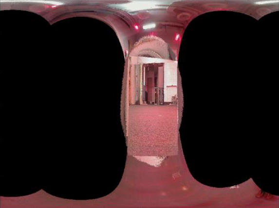

# **Panorama**
- - -
## **Introduction**
* ### Implemented an unscented Kalman filter (UKF) to estimate the 3D orientation of a rotating body using IMU reading
* ### Generated panoramic images by stitching camera images based on the UKF estimation results

## **Results**
* ### Result 1

* ### Result 2


## **Requirements**
* ### Python 3 
* ### [Training data](https://drive.google.com/open?id=0B241vEW29598UjlWOUFwaTNnRlE) (from professor Atanasov)
* ### [Test data](https://drive.google.com/open?id=0B241vEW29598Z09xeE5xUExLN2s) (from professor Atanasov)

## **Run**
* ### Put the program under ```src```
* ### Put the training data under ```trainset```
* ### Put the testing data under ```testset```
* ### Run the program with ```python main.py```
